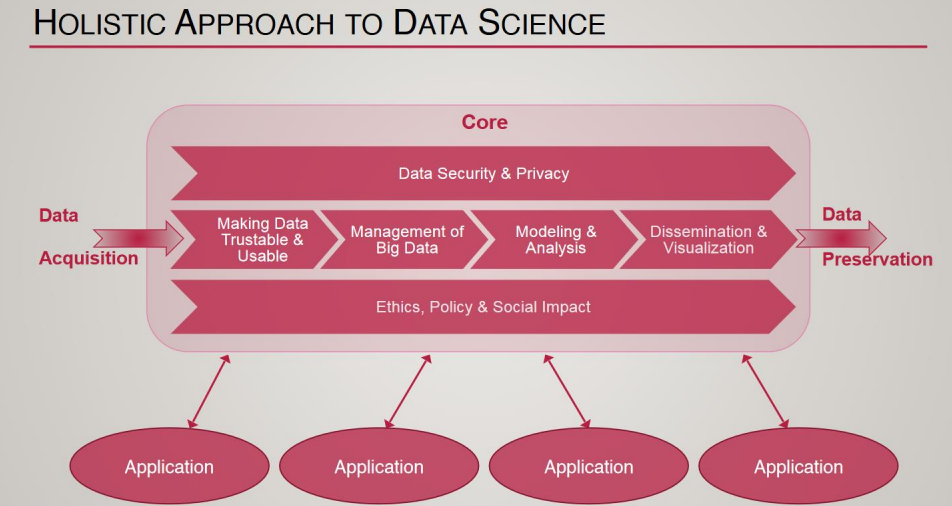
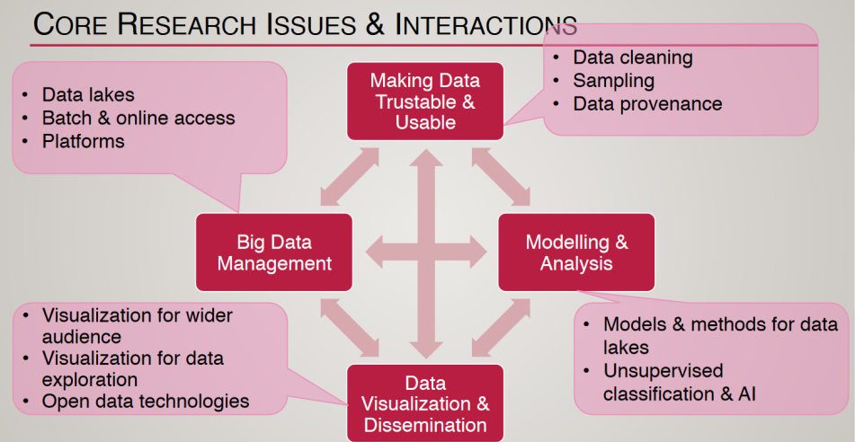

#  DATA ANALYTICS

Data Science is a broad field that uses a variety of tools and languages. Here are some of the most commonly used ones and their official documentation:

Python: https://docs.python.org/3/
R: https://www.r-project.org/other-docs.html
SciKit-Learn: https://scikit-learn.org/stable/user_guide.html
TensorFlow: https://www.tensorflow.org/guide
PyTorch: https://pytorch.org/docs/stable/index.html
Pandas: https://pandas.pydata.org/docs/
NumPy: https://numpy.org/doc/
Matplotlib: https://matplotlib.org/stable/contents.html
Seaborn: https://seaborn.pydata.org/
Jupyter Notebook: https://jupyter-notebook.readthedocs.io/en/stable/

Data Science
---

Data Science is 
- a multidisciplinary field 
  - that uses scientific methods, processes, algorithms, and systems to extract knowledge and insights from structured and unstructured data. 
- It employs techniques and theories drawn from many fields 
  - within the context of mathematics, statistics, computer science, and information science.

### Subdomains of Data Science:

1. Machine Learning: 
   - This involves creating and implementing algorithms 
     - that help machines receive data and use this data to make decisions without human intervention. [ Prediction]

2. Deep Learning: 
   - This is a subset of machine learning where algorithms are created and function similar to the human brain, called artificial neural networks.

3. Artificial Intelligence: 
   - a broader concept of machines, 
     - being able to carry out tasks in a way that we would consider “smart” or “intelligent”.

4. Predictive Analytics: 
   - This uses data, statistical algorithms, and machine learning techniques 
     - to identify the likelihood of future outcomes based on historical data.

5. Data Mining: 
   - This involves exploring and analyzing large amounts of data 
     - to discover patterns and other useful information.

6. Big Data: 
   - This refers to the vast volume of data     
     - that is beyond the ability of traditional databases to capture, store, manage, and analyze.

Data Science tools:
---

Programming Languages: 
- [ Python ], R, SQL, and Julia are commonly used for data manipulation and analysis.

Data Cleaning Tools: 
- [ Pandas (Python library) ], Tidyverse (R package), and OpenRefine are used for cleaning and transforming data.

Data Visualization Tools: 
- Matplotlib, Seaborn (Python libraries), ggplot2 (R package), Tableau, and PowerBI are used for creating interactive and static visualizations.
- Matplotlib and Seaborn (Python libraries) for coding-based environments, and 
- Tableau for GUI-based environments.

Machine Learning Libraries: 
- Scikit-learn (Python), Caret (R), TensorFlow, PyTorch, and Keras are used for building machine learning models.
- Scikit-learn for simpler machine learning models and 
- TensorFlow for complex models and deep learning.

Big Data Tools: 
- Apache Hadoop, Apache Spark, and Hive are used for processing and analyzing big data.
- Apache Hadoop for data storage and 
- Apache Spark for data processing.

Data Analysis Tools: 
- [ Excel ], Google Sheets, SPSS, and SAS are used for basic data analysis and statistical modeling.

Integrated Development Environments (IDEs): 
- Jupyter Notebook, RStudio, PyCharm, and Visual Studio Code are used for writing and running code.

Version Control Systems: 
- Git and GitHub are used for version control.

Cloud Services: 
- [ AWS ], Google Cloud, and Microsoft Azure provide various services for data storage, computation, and machine learning tasks.

Databases: 
- MySQL, PostgreSQL, MongoDB, and SQLite are used for storing and retrieving data.
- MySQL for relational databases and 
- MongoDB for NoSQL databases.
  
Data Warehousing Tools: 
- [ Google BigQuery, Amazon Redshift ], and Snowflake are used for managing large volumes of data.

ETL Tools: 
- [ Informatica ], Talend, and Apache Beam are used for the extraction, transformation, and loading of data.

